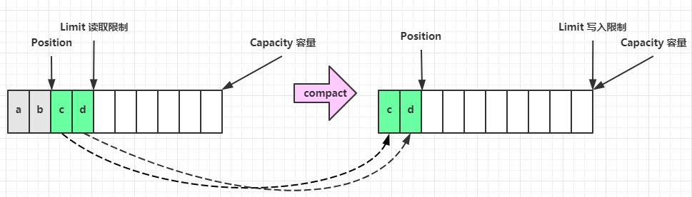

### ByteBuffer 结构

ByteBuffer 有以下重要属性

* capacity
* position
* limit

一开始

写模式下，position 是写入位置，limit 等于容量，下图表示写入了 4 个字节后的状态

flip 动作发生后，position 切换为读取位置，limit 切换为读取限制

读取 4 个字节后，状态

clear 动作发生后，状态

compact 方法，是把未读完的部分向前压缩，然后切换至写模式

