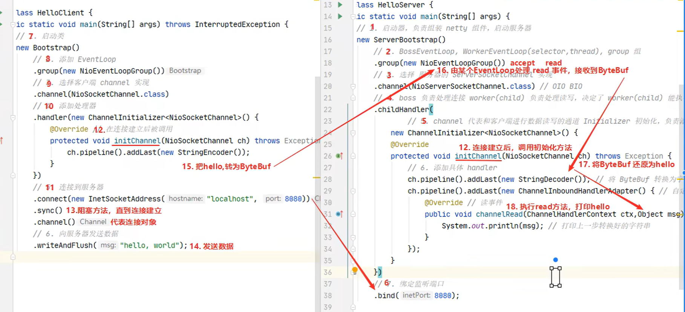

依赖：

```xml
<dependency>
    <groupId>io.netty</groupId>
    <artifactId>netty-all</artifactId>
    <version>4.1.39.Final</version>
</dependency>
```


入门案例解析:




##  组件

### EventLoop

事件循环对象

EventLoop 本质是一个单线程执行器（同时维护了一个 Selector），里面有 run 方法处理 Channel 上源源不断的 io 事件。

它的继承关系比较复杂

* 一条线是继承自 j.u.c.ScheduledExecutorService 因此包含了线程池中所有的方法
* 另一条线是继承自 netty 自己的 OrderedEventExecutor，
  * 提供了 boolean inEventLoop(Thread thread) 方法判断一个线程是否属于此 EventLoop
  * 提供了 parent 方法来看看自己属于哪个 EventLoopGroup


事件循环组

EventLoopGroup 是一组 EventLoop，Channel 一般会调用 EventLoopGroup 的 register 方法来绑定其中一个 EventLoop，后续这个 Channel 上的 io 事件都由此 EventLoop 来处理（保证了 io 事件处理时的线程安全）

* 继承自 netty 自己的 EventExecutorGroup

  * 实现了 Iterable 接口提供遍历 EventLoop 的能力

  * 另有 next 方法获取集合中下一个 EventLoop

    

#### 💡优雅关闭

优雅关闭 `shutdownGracefully` 方法。该方法会首先切换 `EventLoopGroup` 到关闭状态从而拒绝新的任务的加入，然后在任务队列的任务都处理完成后，停止线程的运行。从而确保整体应用是在正常有序的状态下退出的


###  Channel

channel 的主要作用

* close() 可以用来关闭 channel
* closeFuture() 用来处理 channel 的关闭
  * sync 方法作用是同步等待 channel 关闭
  * 而 addListener 方法是异步等待 channel 关闭
* pipeline() 方法添加处理器
* write() 方法将数据写入
* writeAndFlush() 方法将数据写入并刷出


### Future & Promise

在异步处理时，经常用到这两个接口

首先要说明 netty 中的 Future 与 jdk 中的 Future 同名，但是是两个接口，netty 的 Future 继承自 jdk 的 Future，而 Promise 又对 netty Future 进行了扩展

* jdk Future 只能同步等待任务结束（或成功、或失败）才能得到结果
* netty Future 可以同步等待任务结束得到结果，也可以异步方式得到结果，但都是要等任务结束
* netty Promise 不仅有 netty Future 的功能，而且脱离了任务独立存在，只作为两个线程间传递结果的容器

| 功能/名称    | jdk Future                     | netty Future                                                 | Promise      |
| ------------ | ------------------------------ | ------------------------------------------------------------ | ------------ |
| cancel       | 取消任务                       | -                                                            | -            |
| isCanceled   | 任务是否取消                   | -                                                            | -            |
| isDone       | 任务是否完成，不能区分成功失败 | -                                                            | -            |
| get          | 获取任务结果，阻塞等待         | -                                                            | -            |
| getNow       | -                              | 获取任务结果，非阻塞，还未产生结果时返回 null                | -            |
| await        | -                              | 等待任务结束，如果任务失败，不会抛异常，而是通过 isSuccess 判断 | -            |
| sync         | -                              | 等待任务结束，如果任务失败，抛出异常                         | -            |
| isSuccess    | -                              | 判断任务是否成功                                             | -            |
| cause        | -                              | 获取失败信息，非阻塞，如果没有失败，返回null                 | -            |
| addLinstener | -                              | 添加回调，异步接收结果                                       | -            |
| setSuccess   | -                              | -                                                            | 设置成功结果 |
| setFailure   | -                              | -                                                            | 设置失败结果 |


### Handler & Pipeline

ChannelHandler 用来处理 Channel 上的各种事件，分为入站、出站两种。所有 ChannelHandler 被连成一串，就是 Pipeline

* 入站处理器通常是 ChannelInboundHandlerAdapter 的子类，主要用来读取客户端数据，写回结果
* 出站处理器通常是 ChannelOutboundHandlerAdapter 的子类，主要对写回结果进行加工

打个比喻，每个 Channel 是一个产品的加工车间，Pipeline 是车间中的流水线，ChannelHandler 就是流水线上的各道工序，而后面要讲的 ByteBuf 是原材料，经过很多工序的加工：先经过一道道入站工序，再经过一道道出站工序最终变成产品


### ByteBuf

是对字节数据的封装


#### 1）创建

```java
ByteBuf buffer = ByteBufAllocator.DEFAULT.buffer(10);
log(buffer);
```

上面代码创建了一个默认的 ByteBuf（池化基于直接内存的 ByteBuf），初始容量是 10

输出

```
read index:0 write index:0 capacity:10
```

其中 log 方法参考如下

```java
private static void log(ByteBuf buffer) {
    int length = buffer.readableBytes();
    int rows = length / 16 + (length % 15 == 0 ? 0 : 1) + 4;
    StringBuilder buf = new StringBuilder(rows * 80 * 2)
        .append("read index:").append(buffer.readerIndex())
        .append(" write index:").append(buffer.writerIndex())
        .append(" capacity:").append(buffer.capacity())
        .append(NEWLINE);
    appendPrettyHexDump(buf, buffer);
    System.out.println(buf.toString());
}
```


#### 2）直接内存 vs 堆内存

可以使用下面的代码来创建池化基于堆的 ByteBuf

```java
ByteBuf buffer = ByteBufAllocator.DEFAULT.heapBuffer(10);
```

也可以使用下面的代码来创建池化基于直接内存的 ByteBuf

```java
ByteBuf buffer = ByteBufAllocator.DEFAULT.directBuffer(10);
```

* 直接内存创建和销毁的代价昂贵，但读写性能高（少一次内存复制），适合配合池化功能一起用
* 直接内存对 GC 压力小，因为这部分内存不受 JVM 垃圾回收的管理，但也要注意及时主动释放


#### 3）池化 vs 非池化

池化的最大意义在于可以重用 ByteBuf，优点有

* 没有池化，则每次都得创建新的 ByteBuf 实例，这个操作对直接内存代价昂贵，就算是堆内存，也会增加 GC 压力
* 有了池化，则可以重用池中 ByteBuf 实例，并且采用了与 jemalloc 类似的内存分配算法提升分配效率
* 高并发时，池化功能更节约内存，减少内存溢出的可能

池化功能是否开启，可以通过下面的系统环境变量来设置

```java
-Dio.netty.allocator.type={unpooled|pooled}
```

* 4.1 以后，非 Android 平台默认启用池化实现，Android 平台启用非池化实现
* 4.1 之前，池化功能还不成熟，默认是非池化实现


#### 4）组成

ByteBuf 由四部分组成


最开始读写指针都在 0 位置


#### 5）写入

方法列表，省略一些不重要的方法

| 方法签名                                                     | 含义                   | 备注                                        |
| ------------------------------------------------------------ | ---------------------- | ------------------------------------------- |
| writeBoolean(boolean value)                                  | 写入 boolean 值        | 用一字节 01\|00 代表 true\|false            |
| writeByte(int value)                                         | 写入 byte 值           |                                             |
| writeShort(int value)                                        | 写入 short 值          |                                             |
| writeInt(int value)                                          | 写入 int 值            | Big Endian，即 0x250，写入后 00 00 02 50    |
| writeIntLE(int value)                                        | 写入 int 值            | Little Endian，即 0x250，写入后 50 02 00 00 |
| writeLong(long value)                                        | 写入 long 值           |                                             |
| writeChar(int value)                                         | 写入 char 值           |                                             |
| writeFloat(float value)                                      | 写入 float 值          |                                             |
| writeDouble(double value)                                    | 写入 double 值         |                                             |
| writeBytes(ByteBuf src)                                      | 写入 netty 的 ByteBuf  |                                             |
| writeBytes(byte[] src)                                       | 写入 byte[]            |                                             |
| writeBytes(ByteBuffer src)                                   | 写入 nio 的 ByteBuffer |                                             |
| int writeCharSequence(CharSequence sequence, Charset charset) | 写入字符串             |                                             |

> 注意
>
> * 这些方法的未指明返回值的，其返回值都是 ByteBuf，意味着可以链式调用
> * 网络传输，默认习惯是 Big Endian


#### 6）扩容

再写入一个 int 整数时，容量不够了（初始容量是 10），这时会引发扩容

```java
buffer.writeInt(6);
log(buffer);
```

扩容规则是

* 如何写入后数据大小未超过 512，则选择下一个 16 的整数倍，例如写入后大小为 12 ，则扩容后 capacity 是 16
* 如果写入后数据大小超过 512，则选择下一个 2^n，例如写入后大小为 513，则扩容后 capacity 是 2^10=1024（2^9=512 已经不够了）
* 扩容不能超过 max capacity 会报错